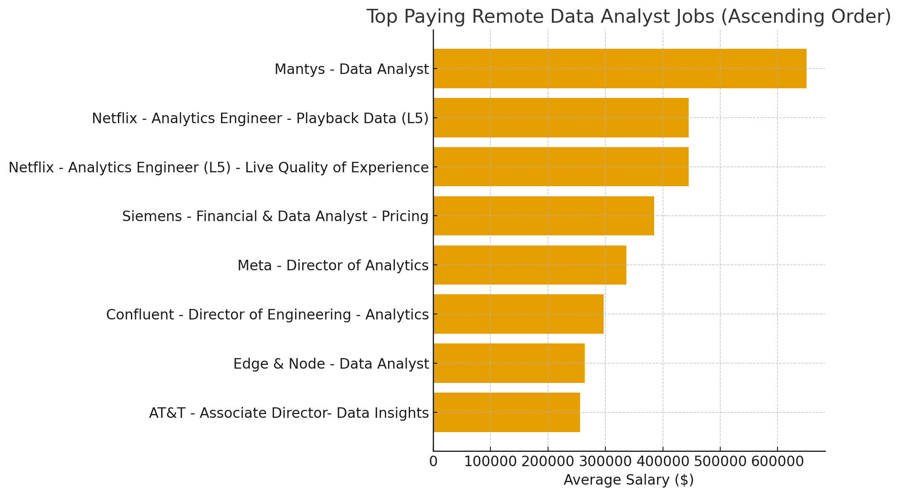
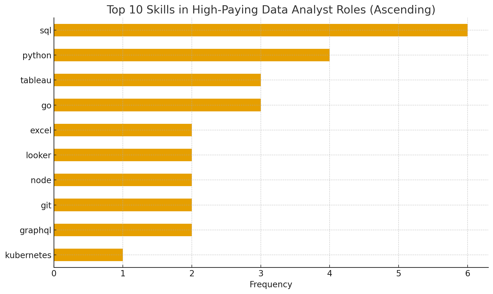

# Introduction

📊 Dive into the data job market! Focusing on data analyst roles, this project explores 💰 top-paying jobs, 🔥 in-demand skills, and 📈 where high demand meets high salary in data analytics.

🔎 SQL queries? Check them out here: [project_sql folder](/project_sql/)

# Background

Driven by a quest to navigate the data analyst job market more effectively, this project was born from a desire to pinpoint top-paid and in-demand skills, streamlining others' work to find optimal jobs.

This data hails from [Luke Barousse's data website](https://lukebarousse.com/sql). It's packed with insights on job titles, salaries, locations, and essential skills.

### The questions I wanted to answer through my SQL queries were:

1. What are the top-paying data analyst jobs?
2. What skills are required for these top-paying jobs?
3. What skills are most in demand for data analysts?
4. Which skills are associated with higher salaries?
5. What are the most optimal skills to learn?

# Tools I Used

For my deep dive into the data analyst job market, I harnessed the power of several key tools:

- **SQL**: The backbone of my analysis, allowing me to query the database and unearth critical insights.
- **PostgreSQL**: The chosen database management system, ideal for handling the job posting data.
- **Visual Studio Code**: My go-to for database management and executing SQL queries.
- **Git & Github**: Essential for version control and sharing my SQL scripts and analysis, ensuring collaboration and project tracking.

# The Analysis

Each query for htis project aimed at investingating specific aspects fo the data analyst job market. Here's how I approached each question:

### 1. Top Paying Data Analyst Jobs

To identify the highest-paying roles, I filtered data analyst positions by average yearly salary and location, focusing on remote jobs. This query highlights the high paying opportunities in the field.

```sql
SELECT
  job_id,
  job_title,
  job_location,
  job_schedule_type,
  salary_year_avg,
  job_posted_date,
  cd.name AS company_name
FROM job_postings_fact jp
INNER JOIN company_dim cd
ON cd.company_id = jp.company_id
WHERE (
  job_title_short = 'Data Analyst' AND
  job_location = 'Anywhere' AND
  salary_year_avg IS NOT NULL
)
ORDER BY salary_year_avg DESC
LIMIT 10;
```

Here's a breakdown of the top data anlyst jobs up to June 30, 2025:

- **Wide Salary Range:** Top-end remote analyst salaries exceed $600K, with the highest paid role being a standard “Data Analyst” at Mantys ($650K), showing that remote compensation can reach Silicon-Valley executive levels when tied to high-growth or specialized companies.

- **Netflix dominates the top tier**, consistently offering ~$445K for Analytics Engineer (L5) roles — indicating that “analytics engineer” titles command much higher pay than traditional data analyst positions, especially at tech giants.

- **Job Title Variety:** Director-level data roles (Meta, Confluent, AT&T) also appear with salaries between ~$255K–$336K, showing that remote leadership positions in analytics remain highly compensated and accessible without geographical restriction.


_Bar graph visualizing the salary for the top 10 salaries for data analysts; ChatGPT generated this graph from my SQL query results_

### 2. Skills for Top Paying Jobs

To understand what skills are required for the top-paying jobs, I joined the job postings with the skills data, providing insights into what employers value for high-compensation roles.

```sql
WITH top_paying_jobs AS (
  SELECT
    jp.job_id,
    job_title,
    salary_year_avg,
    cd.name AS company_name
  FROM job_postings_fact jp
  INNER JOIN company_dim cd ON cd.company_id = jp.company_id
  WHERE (
    job_title_short = 'Data Analyst' AND
    job_location = 'Anywhere' AND
    salary_year_avg IS NOT NULL
  )
  ORDER BY salary_year_avg DESC
  LIMIT 10
)
SELECT
  top_paying_jobs.*,
  sd.skills as skill_name
FROM top_paying_jobs
INNER JOIN skills_job_dim sjd ON sjd.job_id = top_paying_jobs.job_id
INNER JOIN skills_dim sd ON sd.skill_id = sjd.skill_id
ORDER BY top_paying_jobs.salary_year_avg DESC;
```

Here's a quick breakdown of the skills listed for top-paying roles:

- **SQL and Python dominate high-salary roles** -
  this shows top-earning analysts are expected to handle data querying + advanced analysis or automation

- **Tableau stands out among specialized tools** showing companies pay more for analysts who can present insights clearly.

- **Cloud / data engineering skills** show up consistently, suggesting that analysts who can work with modern data pipelines and distributed systems command higher pay.


_Bar graph visualizing the count of the top 10 skills for the top 10 paying jobs for data analysts; ChatGPT generated this graph from my SQL query results_

### 3. In-demand Skills for Data Analysts

This query helped identify the skilsl most frequently requested in job postings, directing focus to areas with high demand.

```sql
SELECT
    sd.skills AS skill,
    count(sjd.job_id) AS demand_count
FROM job_postings_fact jp
INNER JOIN skills_job_dim sjd ON sjd.job_id = jp.job_id
INNER JOIN skills_dim sd ON sd.skill_id = sjd.skill_id
WHERE jp.job_title_short = 'Data Analyst'
GROUP BY sd.skills
ORDER BY demand_count DESC
LIMIT 5;
```

Here's a breakdown of the most demanded skills for data analysts (up to June 30, 2025):

- SQL is the single most in-demand skill for data analysts
- Excel remains extremely strong, even above Python, emphasizing the need for strong foundational skills in spreadsheet manipulation
- Python, Tableau, and Power BI round out the top-5, showing that analysts need both programming + visualization + spreadsheet skills

| Skill    | Demand Count |
| -------- | ------------ |
| sql      | 180369       |
| excel    | 131822       |
| python   | 116082       |
| tableau  | 90588        |
| power bi | 84353        |

_Table of the demand for the top 5 skills in data analyst job postings_

### 4. Skills Based on Salary

Exploring the average salaries associated with different skills revealed which skills are the highest paying.

```sql
SELECT
  sd.skills AS skill,
  ROUND(AVG(jp.salary_year_avg),0) AS avg_salary
FROM job_postings_fact jp
INNER JOIN skills_job_dim sjd ON sjd.job_id = jp.job_id
INNER JOIN skills_dim sd ON sd.skill_id = sjd.skill_id
WHERE (
  jp.job_title_short = 'Data Analyst' AND
  jp.salary_year_avg IS NOT NULL
  )
GROUP BY skill
ORDER BY avg_salary DESC
LIMIT 25;
```

Here's a quick breakdown of the results for the top paying skills based on salary:

- **The highest-paying skills skew toward software engineering & backend frameworks** (FastAPI, Blazor, ASP.NET Core, React.js, Golang), showing that “analytics engineers” earn substantially more than dashboard/reporting analysts.

- **Cloud, NoSQL, and infrastructure tools** like DynamoDB, Terraform, ElasticSearch, and Neo4j appear frequently — signaling that companies pay more for analysts who work with big data pipelines and distributed systems.

- **AI/ML-focused technologies** such as Hugging Face, MXNet, Watson, and GraphQL provide a salary boost, suggesting that analysts who support machine learning workflows fall into the top earning tier.

| Skills       | Average Salary ($) |
| ------------ | ------------------ |
| fastapi      | 212500             |
| svn          | 185000             |
| blazor       | 161000             |
| apl          | 155000             |
| mxnet        | 149000             |
| graphql      | 137699             |
| typescript   | 135520             |
| asp.net core | 130500             |
| dynamodb     | 129970             |
| solidity     | 128313             |

_Table of the average salary for the top 10 paying skills for data analysts_

### 5. Most Optimal Skills to Learn

Combining insights from demand and salary data, this query aimed to pinpoint skills that are both in high demand and have high salaries, offering a strategic focus for skill development.

```sql
SELECT
    sd.skill_id,
    sd.skills AS skill,
    count(sjd.job_id) AS demand_count,
    ROUND(AVG(jp.salary_year_avg),0) AS average_salary
FROM job_postings_fact jp
INNER JOIN skills_job_dim sjd ON sjd.job_id = jp.job_id
INNER JOIN skills_dim sd ON sd.skill_id = sjd.skill_id
WHERE
    jp.job_title_short = 'Data Analyst' AND
    jp.job_work_from_home = TRUE AND
    jp.salary_year_avg IS NOT NULL
GROUP BY
    sd.skill_id
HAVING count(sjd.job_id) > 10
ORDER BY
    demand_count DESC,
    average_salary DESC
LIMIT 25;
```

| Skill ID | Skills     | Demand Count | Average Salary ($) |
| -------- | ---------- | ------------ | ------------------ |
| 0        | sql        | 783          | 98748              |
| 183      | tableau    | 505          | 102172             |
| 1        | python     | 494          | 98074              |
| 184      | excel      | 441          | 88202              |
| 186      | power bi   | 293          | 95535              |
| 2        | r          | 289          | 97421              |
| 185      | looker     | 117          | 94281              |
| 8        | sas        | 110          | 94101              |
| 194      | sas        | 110          | 94101              |
| 198      | powerpoint | 97           | 88567              |

_Table of the most optimal skills for data analysts sorted by salary_

Here's a breakdown of the most optimal skills for Data Analysts (up to June 30, 2025):

- **SQL, Tableau, Python, and Excel** dominate demand, showing that the core analyst toolset still revolves around querying, scripting, visualization, and spreadsheet analysis.

- **Cloud data warehouse skills** (Snowflake, AWS, BigQuery, Redshift, Azure) appear throughout the dataset, signaling that analysts are expected to interact with modern data pipelines and distributed data systems, not just spreadsheets.

- Some low-demand skills carry very high average salaries like Zoom ($139K) and Go ($121K), which can suggest that niche technical expertise or cross-functional tooling can command premium pay.

# What I Learned

Throughout this adventure, I've turbocharged SQL toolkit with some serious firepower:

- 🧩 Complex Query Crafting: Mastered the art of advanced SQL, merging tables like a pro and wielding WITH clauses for ninja-level temp table maneuvers.
- 📊 Data Aggregation: Got comfortable with GROUP BY and turned aggregate functions like COUNT() and AVG() into my data-summarizing sidekicks.
- 💡 Analytical Wizardry: Leveled up my real-word puzzle-solving skills, turning questions into actionable, insightful SQL queries.

# Conclusions

### Insights

1. **Top-Paying Data Analyst Jobs**: The highest-paying data analyst jobs that allow remote work offer a wide range of salaries. The highest at $650,000!
2. **Skills for Top-Paying Jobs**: High-paying data analyst jobs require advanced proficiency in SQL, indicating that it's a critical skill for earning a top salary.
3. **Most In-demand Skills**: SQL is also the most in-demand skill in the data analyst job market. Making it essential for job seekers like me.
4. **Skills with Higher Salaries**: Specialized skills, such as FastAPI and SVN, are associated with the highest average salaries, indicating a premium on niche expertise.
5. **Optimal Skills for Job Market Value**: SQL leads in demand and offers a high average salary, positioning it as one of the most optimal skills for data analysts to learn to maximize their market value.

### Closing Thoughts

This project enhanced my SQL skills and provided valuable insights into the data analyst job market. The findings from the analysis serve as a guide to prioritizing skill development and job search efforts. Aspiring data analysts, like myself, can better position themselves in a competitive job market by focusing on high-demand, high-salary skills. This exploration highlights the importance of continuous learning and adaptation to emerging trends in the field of data analytics.
